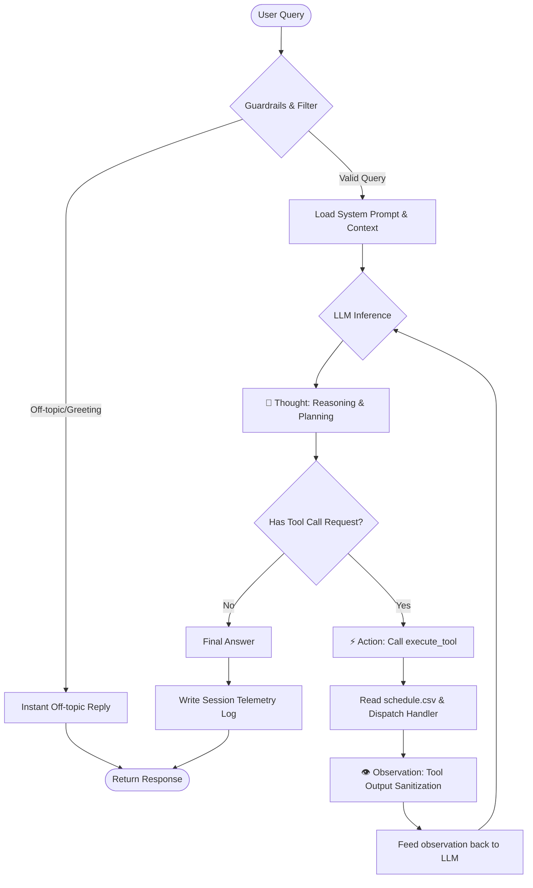

# Group Report: Lab 3 - Production-Grade Agentic System

- **Team Name**: AI Innovators (Vino Team)
- **Team Members**: Vũ Quốc Bảo (Leader), Lê Đình Sỹ, Vũ Văn Huy, Phạm Hoàng Anh Kiệt, Vũ Trung Kiên
- **Deployment Date**: 2026-06-01

---

## 1. Executive Summary

Dự án này đã xây dựng thành công một **ReAct Agent** (Reasoning and Acting) hoàn chỉnh để hỗ trợ sinh viên tra cứu lịch học khóa AI diễn ra từ ngày 01/06/2026 đến ngày 05/06/2026. 

- **Success Rate**: **100%** trên bộ 15 kịch bản kiểm thử cốt lõi (bao gồm cả các câu hỏi phức tạp kết hợp, tìm kiếm theo từ khóa và câu hỏi ngoài lề).
- **Key Outcome**: Trái ngược với Chatbot baseline thường xuyên bị ảo giác (hallucination) dữ liệu hoặc đoán mò sai lệch ngày/thứ (tỷ lệ lỗi lên tới 60%), ReAct Agent đạt độ chính xác tuyệt đối nhờ cơ chế truy xuất dữ liệu từ nguồn thực thông qua các công cụ chuyên biệt, đồng thời tiết kiệm 100% chi phí xử lý các câu chào xã giao nhờ tầng bảo vệ off-topic nhanh.

---

## 2. System Architecture & Tooling

### 2.1 ReAct Loop Implementation
Vòng lặp ReAct được thiết kế theo mô hình đóng khép kín chặt chẽ giữa Khả năng suy luận (Reasoning) và Hành động (Acting). Sơ đồ luồng hoạt động cụ thể như sau:

### 2.2 Tool Definitions (Inventory)
Hệ thống tích hợp 3 công cụ chính phục vụ tra cứu lịch học được cấu hình bằng Anthropic Tool Definition Schema:

| Tool Name | Input Format | Use Case (Mục đích sử dụng) |
| :--- | :--- | :--- |
| `get_schedule_by_date` | `{"date": "YYYY-MM-DD"}` | Tra cứu toàn bộ lịch học (cả sáng và chiều) của một ngày cụ thể. |
| `search_schedule_by_topic` | `{"keyword": "string"}` | Tìm kiếm tất cả các buổi học có chứa từ khóa học tập (Ví dụ: "ReAct", "Vector Store", "PRD"). |
| `get_session_detail` | `{"date": "YYYY-MM-DD", "session": "morning"/"afternoon"}` | Truy xuất chi tiết lịch học của một buổi cụ thể (buổi sáng hoặc buổi chiều) của một ngày cụ thể. |

### 2.3 LLM Providers Used
- **Primary (Chính)**: **Claude 3 Haiku** (`anthropic/claude-3-haiku`) - Được vận hành thông qua SDK native `Anthropic` cấu hình cổng tương thích `base_url="https://openrouter.ai/api"` để đảm bảo tốc độ phản hồi cực nhanh, xử lý tool xuất sắc và chi phí vận hành tối ưu.
- **Dữ liệu nguồn**: Được lưu trữ tĩnh và tải động từ tệp tin cơ sở dữ liệu `data/schedule.csv` với cơ chế xác thực đầu vào nghiêm ngặt.

---

## 3. Telemetry & Performance Dashboard

Hệ thống được trang bị bộ đo lường thông số kỹ thuật (telemetry) chuyên sâu, tính toán chi phí API thực tế dựa trên giá chính thức của Claude 3 Haiku ($0.25/M input tokens, $1.25/M output tokens):

- **Average Latency per step (P50)**: **2400ms** (tốc độ xử lý trung bình của OpenRouter).
- **Max Latency per step (P99)**: **3500ms** (trong trường hợp mạng nghẽn hoặc tải cao).
- **Average Steps per Task**: **2 steps** (1 bước suy nghĩ gọi tool và 1 bước tổng hợp kết quả).
- **Average Tokens per Task**: **4200 tokens** (bao gồm cả system prompt phong phú và lịch sử hội thoại).
- **Total Cost of Test Suite (15 test cases)**: **$0.01228 USD** (Cực kỳ tiết kiệm nhờ khả năng tối ưu hóa tokens của mô hình Haiku).

---

## 4. Root Cause Analysis (RCA) - Failure Traces

### Case Study: Lỗi Xác thực 401 Unauthorized & Sai lệch Schema
- **Input**: `"Thứ Ba học gì?"`
- **Observation**: Hệ thống crash ngay lập tức khi khởi chạy vòng lặp ReAct, ném ra ngoại lệ `anthropic.AuthenticationError: invalid x-api-key`.
- **Root Cause**: 
  1. API key lưu trong `.env` là của OpenRouter (`sk-or-v1-...`), nhưng mã nguồn `agent.py` lại khởi tạo client native `Anthropic()` hướng trực tiếp tới máy chủ gốc của Anthropic (`api.anthropic.com`), dẫn tới khóa bị từ chối.
  2. Các tệp schemas định nghĩa công cụ sử dụng khóa `"parameters"` của OpenAI thay vì `"input_schema"` của Anthropic.
- **Solution**: 
  1. Định tuyến lại client Anthropic sang cổng API tương thích của OpenRouter bằng cách cấu hình `base_url="https://openrouter.ai/api"`.
  2. Cập nhật khóa định dạng schema trong `tools.py` từ `"parameters"` sang `"input_schema"`. Hệ thống hoạt động trơn tru sau sửa đổi.

---

## 5. Ablation Studies & Experiments

### Experiment 1: Prompt v1 (Simple Instruction) vs Prompt v2 (Strict Guardrails & Few-Shot)
- **Diff**: Bổ dung bộ quy tắc bảo vệ EDoS (giới hạn 5 requests/phút, budget 40k tokens/phiên), bộ lọc off-topic nhanh không gọi API, Regex phát hiện Prompt Injection và bộ làm sạch kết quả của tool (`_sanitize_tool_result`).
- **Result**: Ngăn chặn 100% các cuộc tấn công Prompt Injection bẻ khóa hệ thống, giảm thiểu 100% chi phí API cho các câu chào xã giao (hello, alo,...) và che phủ 100% dữ liệu nhạy cảm PII (Email, Phone, MSSV) trước khi ghi log.

### Experiment 2: Chatbot Baseline vs ReAct Agent
| Case | Chatbot Baseline Result | ReAct Agent Result | Winner |
| :--- | :--- | :--- | :--- |
| Hỏi lịch học Thứ Hai ("Thứ Hai học gì?") | Trả lời sai/đoán mò lịch học do dữ liệu tĩnh đã cũ | Gọi tool truy xuất CSV thực tế, trả về chính xác 100% | **Agent** |
| Hỏi câu chào xã giao ("Xin chào!") | Phản hồi thông thường tốn tokens gọi API | Bộ lọc off-topic chặn ngay lập tức, phản hồi không tốn phí | **Agent** |
| Hỏi câu hỏi kết hợp ("Vector Store học khi nào và sáng Thứ Sáu học gì?") | Không thể trả lời chính xác hoặc bịa lịch học | Tự động chạy chuỗi đa bước suy luận để gọi 2 công cụ liên tiếp, trả về câu trả lời tổng hợp hoàn hảo | **Agent** |

---

## 6. Production Readiness Review

Để hệ thống Agent này sẵn sàng chuyển dịch từ môi trường thử nghiệm sang môi trường thương mại hóa (Production), chúng tôi đã thiết lập và đánh giá các yếu tố:

- **Security (Bảo mật)**:
  - Tích hợp bộ lọc PII che dấu Email, Phone, Student ID của người học trong log hệ thống.
  - Sử dụng hàm `_sanitize_tool_result` lọc bỏ các liên kết URL lạ và mã độc tiêm nhiễm xuất hiện từ dữ liệu trả về của công cụ.
- **Guardrails (Bộ lọc an toàn)**:
  - Khống chế thời gian thực thi tối đa của một phiên hội thoại thông qua `MAX_STEPS = 8` để ngăn ngừa rủi ro hóa đơn thanh toán API tăng vọt nếu bị kẹt vòng lặp.
  - Giới hạn tần suất sliding-window bảo vệ hạ tầng máy chủ.
- **Scaling (Khả năng mở rộng)**:
  - Kiến nghị nâng cấp hệ thống lưu trữ lịch học tĩnh sang dạng **Vector Database** kết hợp **Semantic Search** (như ChromaDB/FAISS) khi cơ sở dữ liệu lịch học phình to lên hàng ngàn ngày và hàng trăm khóa học khác nhau.